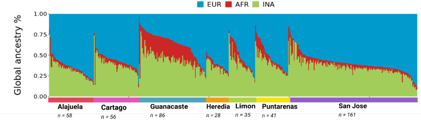
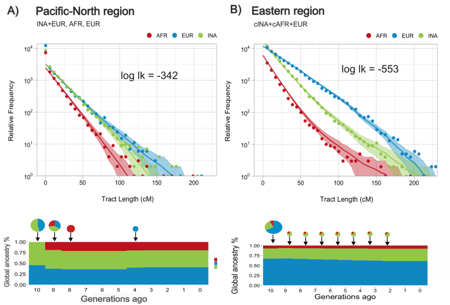

> MSc Thesis Project | Population Genetics | Reproducible Genomics

# Costa Rican Population Genetics – MSc Thesis Project

This repository showcases the analytical workflows and methods developed for my MSc thesis in Medical Genetics (UBC), focused on understanding population structure and ancestry patterns in Costa Rica (*manuscript in preparation*).

Full thesis available at: https://open.library.ubc.ca/soa/cIRcle/collections/ubctheses/24/items/1.0451194?o=1 

## Why this project

Population genetics in Latin America is often underrepresented despite its complexity. This project explores fine-scale structure within Costa Rica by combining cohort data with global reference panels, with the goal of producing reproducible, interpretable analyses that connect genetic patterns to historical and demographic context.

Beyond the scientific question, this work reflects my approach to data: building workflows that are robust, transparent, and adaptable to real-world datasets.

---

## Reproducibility

The analysis was developed alongside a structured review and validation process to ensure consistency between methods, results, and interpretation :contentReference[oaicite:0]{index=0}.

To run similar analyses:
- Follow `/.md` / `/.html` files for each analysis step:
    - Genotyping QC: CRELES_genotyping_QC_v3
    - Global Ancestry: ADMIXTURE
    - Local ancestry: CRELES_local-ancestry-inference
    - Tracs migration modelling: Tracts_analysis_recap
- Update file paths to your environment  
- Ensure required tools are installed (PLINK, ADMIXTURE, R, etc.)
  
*Note*: This project was developed in an HPC environment using SLURM-based workflows.

---

## Key Results 

### Genetic diversity in the *analyzed* Costa Rican population reveals regional substructure

#### Global Ancestry (*ADMIXTURE*)

Unsupervised ancestry estimation (k=3) reveals varying proportions of European, African, and Indigenous American ancestry across individuals, highlighting regional differences within Costa Rica.

---

#### Population Structure (*CRELES_genotyping_QC_v3*)

Principal Component Analysis shows separation along continental ancestry axes, with Costa Rican individuals distributed along two regional clusters reflecting admixture patterns.

---

### Regional substructure reflects demographic history of Costa Rica (*Tracts_analysis_recap*)

Using local ancestry to “color” each genome by ancestral origin (Indigenous American, African, European), we applied tract-based modelling to estimate when admixture events happened. In the CRELES cohort, this points to a ~1 generation (≈30-year) delay between Indigenous American–European and African admixture, consistent with regional separation by the Guanacaste mountain range.

## What I did
No great work is possible without collaboration. This work is no exception. Below is a targeted list of the analyses designed and performed by Paola Arguello-Pascualli. 

- Designed and executed a full population genomics analysis pipeline  
- Harmonized cohort data (CRELES) with 1000 Genomes reference populations  
- Applied quality control and filtering strategies for admixed populations  
- Performed global ancestry estimation (ADMIXTURE)  
- Conducted dimensionality reduction (PCA)  
- Estimated population differentiation (FST)  
- Implemented local ancestry inference (Gnomix)  
- Generated publication-ready figures and reproducible outputs  

---

## Contact

If you are interested in this work or would like to discuss potential collaborations, feel free to reach out.
